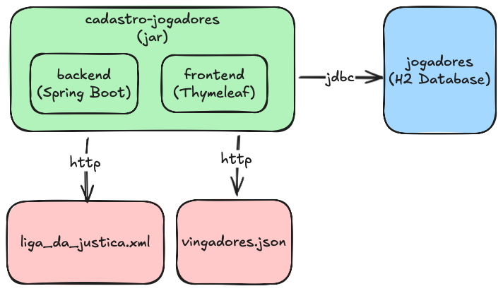

<h1 align="center">
  Desafio Cadastro Jogadores
</h1>


## Tecnologias

- [Spring Boot](https://spring.io/projects/spring-boot)
- [Spring Web](https://docs.spring.io/spring-framework/reference/web.html)
- [Jdbc Client](https://docs.spring.io/spring-boot/reference/data/sql.html#data.sql.jdbc-client)
- [Rest Client](https://docs.spring.io/spring-framework/reference/integration/rest-clients.html#rest-restclient)
- [Thymeleaf](https://docs.spring.io/spring-framework/reference/web/webmvc-view/mvc-thymeleaf.html)
- [Spring Tests](https://docs.spring.io/spring-framework/reference/testing.html)

## Funcionalidades

- [x] Cadastro de Jogador
- [x] Listagem de Jogador
- [x] Tela de Cadastro e Listagem
- [x] Validações e Tratamento de Exceções
- [ ] Teste de Integração

## Arquitetura

O projeto foi elaborado seguindo a arquitetura sugerida no desafio, conforme imagem abaixo:




## Como executar

- Clonar repositório git:
```
https://github.com/HenriqueACF/Cadastro-Jogadores-SpringBoot
```
- Construir o projeto:
```
./mvnw clean package
```
- Executar:
```
java -jar ./target/desafio-cadastro-jogadores-0.0.1-SNAPSHOT.jar
```

A tela inicial pode ser acessada em `http://localhost:8080/cadastro-jogador`.